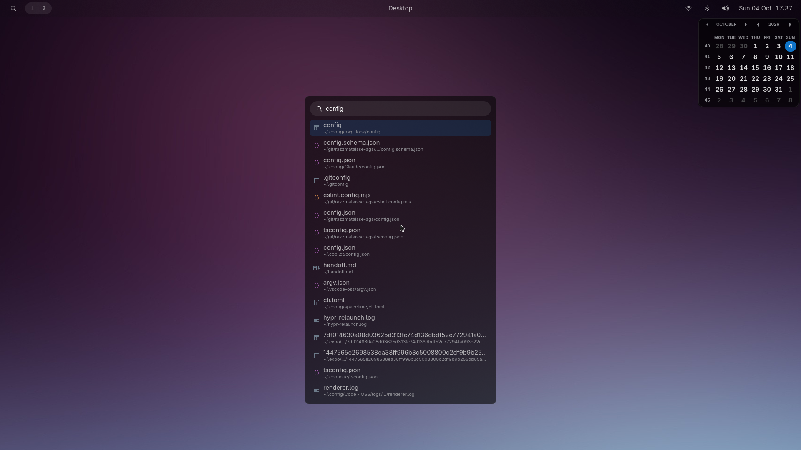

# Razzmataisse AGS

A custom [Hyprland](https://hyprland.org) desktop shell built with
[AGS](https://aylur.github.io/ags-docs/)/[Astal](https://aylur.github.io/astal/)
and [gnim](https://github.com/aylur/gnim) — GTK4 widgets written in
TypeScript/JSX, styled using CSS-in-JS from '@lib/css'.



This project emphasizes portability, ergonomics, and DX — nothing assumes
*your* home directory, *your* username, or any other detail of your
particular machine.

_Getting started is easy, and customizations are a breeze!_

## What's in it

- **Bar** ('src/widget/bar') — a top bar with workspace indicators, the
  active window's title, a launcher button, and status pills for network,
  Bluetooth, volume, and the clock, each opening its own popover.
- **Launcher** ('src/widget/launcher') — a 'SUPER + Space' launcher that docks
  below the bar and expands to a centered panel once you start typing.
  Fuzzy-searches installed apps, searches filenames and file contents under
  '$HOME' via 'rg', shows themed per-file-type icons, and supports
  '$cmd' / '#sudo cmd' to run a one-off shell command in a terminal.
- **@lib/css** ('src/lib/css') — a small CSS-in-JS layer purpose-built for
  GTK4's CSS dialect: 'defineStyle' for reusable, variant-aware classes,
  reactive 'cx(...)' composition driven by Accessors, plus helpers for
  color ('alpha'), transforms, transitions, and GTK-specific properties. See
  [@lib/css](#libcss) below.
- **@lib/hyprland** — talks to Hyprland for things Astal doesn't cover
  directly, e.g. per-surface compositor blur via 'layer_rule'.

Visual and non-visual settings are split into two JSON files at the repo
root: 'theme.json' (colors, transitions, sizing) and 'config.json' (search's
grep command, ignored directories, ignored desktop entries), each bridged
into 'src/' via '@theme'/'@config' since path aliases only cover 'src/'
itself. Both are validated against JSON schemas in [schemas/](schemas/)
(referenced via '$schema', for editor autocomplete and validation).

## Requirements

- [Hyprland](https://hyprland.org)
- [AGS](https://aylur.github.io/ags-docs/) (with GTK4/Astal)
- [Bun](https://bun.sh)
- [ripgrep](https://github.com/BurntSushi/ripgrep) ('rg') — used for the
  launcher's file search; configurable via 'config.json'

## Getting started

```sh
curl -fsSL https://raw.githubusercontent.com/mausworks/razzmataisse-ags/main/install.sh | sh
```

Clones the repo into '~/.config/razzmataisse-ags' (where AGS expects it),
then installs dependencies, generates GTK/Astal's TypeScript types, and
runs lint + typecheck so you know right away if anything's actually wrong
rather than finding out the first time you run it.

Already have a checkout? Run the same script from inside it instead:

```sh
./install.sh
```

It's idempotent either way — safe to rerun any time (e.g. after pulling).

Once installed, wire it into Hyprland's config:

```
exec-once = ags run ~/.config/razzmataisse-ags/src/app.ts --gtk 4
```

## Development

```sh
bun run dev
```

'scripts/dev.sh' polls source files once a second and restarts 'ags run' on
change — AGS has no built-in watch mode. While it's running, the bar is
non-exclusive (doesn't reserve screen space) so restarts don't reshuffle
your windows; it pushes the top monitor gap out by the bar's height instead,
for the duration of the dev session.

Other scripts:

```sh
bun run lint         # eslint
bun run format       # prettier --write
bun run test         # bun test
bun run gtk:typegen  # regenerate GTK/Astal GI type declarations
```

## Code style

TypeScript/JavaScript style is documented in
[docs/style/typescript.md](docs/style/typescript.md) and enforced partly by
a handful of project-specific ESLint rules in 'eslint-local-rules.mjs' (e.g.
requiring defineStyle's variant scope, validating transform/transition
values).

## @lib/css

GTK4's CSS dialect is close to the web's, but not identical (no flexbox or
grid, extra GTK-only properties like '-gtk-icon-size', etc.), and widgets
are styled via a 'class' prop rather than inline 'style='. '@lib/css' is a
small CSS-in-JS layer built specifically around those constraints — define
a class once at module scope, then compose it reactively per-instance.

```ts
import { alpha, defineStyle } from "@lib/css";
import theme from "@theme";

const cx = defineStyle({
  style: {
    background: theme.bar.palette.background,
    borderRadius: 8, // numbers become px automatically where that's valid CSS
    padding: "4px 8px",
    "&:hover": { background: alpha(theme.bar.palette.text, 0.08) },
  },
  variants: {
    selected: { background: alpha(theme.bar.palette.accent, 0.16) },
  },
});

cx(); // "cl1"
cx("selected"); // "cl1 cl1 selected"
cx(isSelected && "selected"); // conditional, classnames-style
cx(isSelected.as((s) => s && "selected")); // Accessor in, Accessor<string> out
```

```tsx
<button class={cx(selected.as((s) => s && "selected"))} />
```

Transforms and transitions get typed helpers too, rather than hand-rolled
strings:

```ts
import { defineStyle, transforms, transitions, translateY, scale } from "@lib/css";

const cx = defineStyle({
  style: {
    transform: transforms(translateY(0), scale(1)),
    transition: transitions({
      transform: "150ms ease-out",
      opacity: { duration: 200, easing: "linear", delay: 50 },
    }),
    "&:active": {
      transform: transforms(translateY(2), scale(0.96)),
    },
  },
});
```

See 'src/lib/css/' for the rest — 'animation.ts' (keyframes), 'color.ts'
('alpha'/'mix'/'shade'/...), 'units.ts' ('px'/'percent'/'deg'/...), and
'gtk-extensions.ts' for GTK-only CSS properties.

## Running it for real

Launch the shell the same way 'ags run' normally would, pointed at the
entrypoint:

```sh
ags run src/app.ts --gtk 4
```

Typically wired into Hyprland's own config ('exec-once = ags run ...', see
[Getting started](#getting-started)) rather than started by hand.
